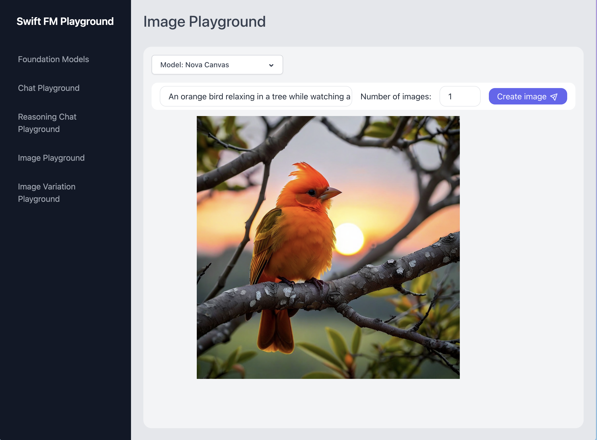

# Swift FM Playground

Welcome to the Swift Foundation Model (FM) Playground, an example app to explore how to use **Amazon Bedrock** with the AWS SDK for Swift.

> 🚨 **Important:** This application is for educational purposes and not intended for production use.



## ⚠ Important

- Running this application might result in charges to your AWS account. For more details, see [Amazon Bedrock Pricing](https://aws.amazon.com/bedrock/pricing/).
- This app is configured to run in `us-east-1` and has not been tested in every AWS Region. For more information see [AWS Regional Services](https://aws.amazon.com/about-aws/global-infrastructure/regional-product-services).
- We recommend that you grant your code least privilege, i.e. only the minimum permissions required by the application. You can find an IAM Policy document with the required permissions in this repository at `resources/bedrock-access-policy.json` ([display policy](./resources/bedrock-access-policy.json)).

## Prerequisites

Ensure you have the following installed:

- [Swift 6.0+](https://www.swift.org/install/) for the backend server.
- [Node.js (v18.17+)](https://docs.npmjs.com/downloading-and-installing-node-js-and-npm) for the frontend application.
- You must have an [AWS account](https://aws.amazon.com/free/), and have your default credentials and AWS Region configured as described in the [AWS Tools and SDKs Shared Configuration and Credentials Reference Guide](https://docs.aws.amazon.com/credref/latest/refdocs/creds-config-files.html).
- You must request access to the models you want to use in the application before you can use them. For more information, see [Model access](https://docs.aws.amazon.com/bedrock/latest/userguide/model-access.html). To run the app, you need access to the following models in `us-east-1`.

## Running the Application

After verifying the prerequisites, follow these steps:

### Clone the repository

Open a terminal, navigate to a directory of your choice, and execute the following command:

```shell
git clone https://github.com/build-on-aws/swift-fm-playground.git
```

### Backend Setup

Navigate to the `backend` directory. Based on the form of authentication you use and the level of logging you want, start the backend.
Possible examples are:

- Using defaultchain for authentication and default loglevel Info

```shell
swift run PlaygroundAPI
```

- Using SSO authentication with profile name "default" and loglevel Trace

```shell
BEDROCK_SERVICE_LOG_LEVEL=trace swift run PlaygroundAPI --sso
```

- Using SSO authentication with profile name "mona" and default loglevel Info

```shell
swift run PlaygroundAPI --sso --profile-name "mona"
```

When the backend is running you will see a similar output:

```shell
Building for debugging...
[1/1] Write swift-version--58304C5D6DBC2206.txt
Build of product 'PlaygroundAPI' complete! (0.40s)
2025-05-15T18:36:47+0200 info HummingbirdBackend : [HummingbirdCore] Server started and listening on 127.0.0.1:8080
```

### Frontend Setup

In a **new terminal window**, navigate to the `frontend` directory and install the packages required by running the following command:

```shell
npm install
```

After successful installation you can start the frontend application by executing the following command:

```shell
npm run dev
```

When the application is running, you will see the following output:

```shell
> frontend@0.1.0 dev
> next dev

   ▲ Next.js 14.0.0
   - Local:        http://localhost:3000

 ✓ Ready in 3.3s

```

> **Note:** The frontend runs on port 3000 by default. See below for port changes.

## Accessing the Application

To access the application, open `http://localhost:3000` in your web browser.

## Stopping the Application

To halt the application, you will need to stop both the backend and frontend processes.

### Stopping the Frontend

In the terminal where the frontend is running, press `Ctrl + C` to terminate the process.

### Stopping the Backend

Similarly, in the backend terminal, use the `Ctrl + C` shortcut to stop the server.
